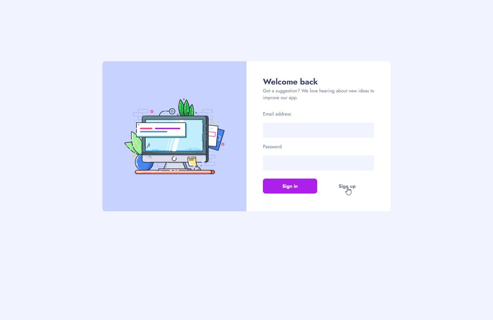

# Frontend Mentor - Product feedback app solution

Excited to share a frontend-focused full-stack app—a real-world product feedback application. This project showcases my technical skills and adds a compelling piece to my portfolio.

This is a solution to the [Product feedback app challenge on Frontend Mentor](https://www.frontendmentor.io/challenges/product-feedback-app-wbvUYqjR6). Frontend Mentor challenges help you improve your coding skills by building realistic projects.

This project was a big challenge, helping me apply and strengthen my recent knowledge in React. It's a major step in my career, demonstrating my ability to handle complex projects, use diverse technologies, and deliver a polished user experience. I'm eager to share this accomplishment as proof of my growth and skills as a frontend developer.

## Table of contents

- [Overview](#overview)
  - [The challenge](#the-challenge)
  - [Screenshot](#screenshot)
  - [Links](#links)
- [My process](#my-process)
  - [Built with](#built-with)
  - [What I learned](#what-i-learned)
  - [Continued development](#continued-development)
- [Author](#author)

## Overview

### The challenge

Users should be able to:

- View the optimal layout for the app depending on their device's screen size
- See hover states for all interactive elements on the page
- Create, read, update, and delete product feedback requests
- Receive form validations when trying to create/edit feedback requests
- Sort suggestions by most/least upvotes and most/least comments
- Filter suggestions by category
- Add comments and replies to a product feedback request
- Upvote product feedback requests
- **Bonus**: Keep track of any changes, even after refreshing the browser (`localStorage` could be used for this if you're not building out a full-stack app)

### Screenshot

### Links

- [Solution URL](https://www.frontendmentor.io/solutions/product-feedback-app-using-react-and-supabase-aRpld_vsJw)
- [Live Site URL](https://product-feedback-frrann.netlify.app/)

## My process

### Built with

- Semantic HTML5 markup
- [Tailwind CSS](https://tailwindcss.com/) - A utility-first CSS framework
- Mobile-first workflow
- ViteJS - Frontend build tool
- [React](https://reactjs.org/) - JS library for building dynamic user interfaces
- [React Router](https://reactrouter.com/en/main) - Routing for SPA
- [React Query](https://tanstack.com/query/v3/) - Remote state management
- [React Hook Form](https://react-hook-form.com/) - Form management
- [React Icons](https://react-icons.github.io/react-icons/) - Scalable vector icons for enhanced visual appeal
- [React Hot Toast](https://react-hot-toast.com/) - Dynamic and customizable toasts for user feedback
- [React Responsive](https://www.npmjs.com/package/react-responsive)
- [Supabase](https://supabase.com/) - Open source Firebase alternative

### What I learned

Working on this project has been a tremendous learning experience, allowing me to deepen my understanding of various technologies and refine my skills as a frontend developer. Below are some of the key learnings from this project:

#### Tailwind CSS and Utility-First Styling
Tailwind CSS proved to be a powerful tool for utility-first styling. It streamlined the styling process and allowed for quick adjustments. 

#### React Query for Data Fetching
Implementing React Query significantly improved the efficiency of data fetching and management. It simplified the process and provided a centralized way to handle API calls. 

#### Responsive Design with React Responsive and Tailwind CSS
Ensuring a seamless experience across various devices was achieved through React Responsive and Tailwind CSS. It allowed me to conditionally render components based on screen size. 

#### Authentication Implementation
In addition to the broader learnings, a specific highlight of this project was the successful implementation of secure authentication. Leveraging Supabase and React Query, I ensured that only authorized users could access the application. The incorporation of features such as login, sign-up, and logout added an essential layer of user-friendliness to the overall experience.

### Continued development

Working on this project has provided valuable insights into my strengths and areas where I can further enhance my skills. As I move forward, I am eager to continue my professional growth by focusing on the following:

#### Advanced React Patterns
While I successfully implemented fundamental React concepts in this project, I now aim to deepen my understanding by mastering efficient component composition.

#### Testing and Test-Driven Development (TDD)
I recognize the importance of testing for ensuring code reliability and maintainability. In future projects, I aspire to embrace Test-Driven Development (TDD) and become proficient in writing comprehensive unit tests and end-to-end tests for my applications.

#### Server-Side Rendering (SSR) and Next.js
To boost performance and improve user experience, I'm eager to explore Server-Side Rendering (SSR) with technologies like Next.js. Mastering efficient SSR implementation will be a valuable addition to my skill set.

#### Accessibility Best Practices
Although I incorporated semantic HTML5 for improved accessibility, I aspire to deepen my understanding of accessibility best practices. This involves learning about ARIA roles, conducting thorough accessibility audits, and ensuring my applications are inclusive for all users.

#### Advanced Authentication Techniques
While successfully implementing basic authentication features, I plan to learn more advanced techniques. This includes securing routes and endpoints and connecting with popular identity providers like Google and GitHub. It's part of my roadmap for improvement.

## Author

- Frontend Mentor - [@frrann](https://www.frontendmentor.io/profile/frrann)
